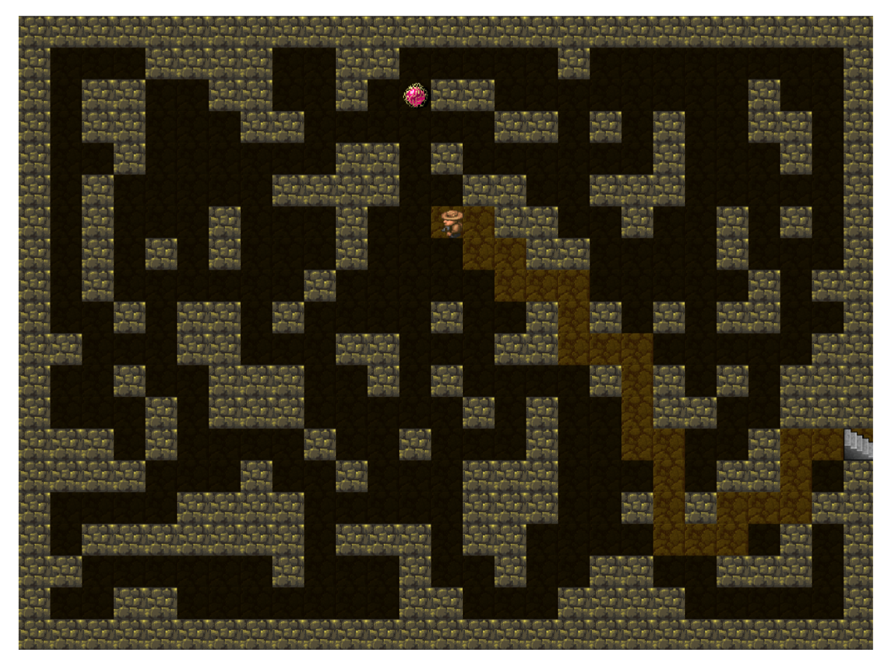
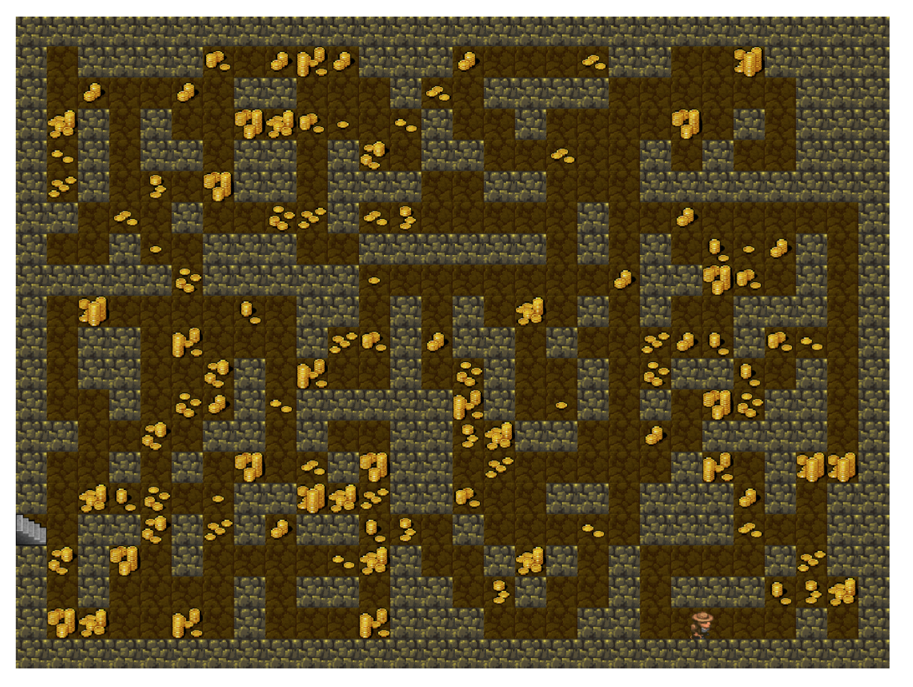

# Philip Hammond and the Temple of Gloom!

Assignment three of the [Principles of Programming II (BBK_BUCI064H7_1718)](https://moodle.bbk.ac.uk/course/view.php?id=21182)
course for the [MSc in Computer Science](http://www.dcs.bbk.ac.uk/study/postgraduate/msc-computer-science/) at
[Birkbeck, University of London](http://www.bbk.ac.uk/).

## Overview

*Philip Hammond* is an explorer and professor of archeology looking for the *Orb of Lots*, which is located in the
*Temple of Gloom*.

In his quest, he will have to explore an unknown cavern under the temple to find the orb, claim it and escape before the
entrance collapses.

As *Philip* his get to retirement without a proper pension plan, this is his last chance to get enough financial means
to support his lifestyle, by collecting as much gold as possible when escaping the cavern.

Hopefully, he will make it, with the help of the device I have built and programmed to guide him inside the cavern. 

## The exploration phase

On the way to the *Orb of Lots*, the layout of the cavern is unknown and the only information available is:
1. the status of the tile where *Philip Hammond* is standing and those immediately around;
2. the distance to the Orb, detected and calculated by the device as the shortest straight path.

During the exploration phase, at every step, the device calculates the distance to the Orb and decides which direction
to take. This was the basis for the first prototype, where it was observed a huge flaw: because the direction taken was
(effectively) random, it would get stuck on paths that are dead ends.

The following prototype was built based on a depth-first search:
* The direction to take considers the distance to the Orb;
* When a dead end is reached, it will back track to the previous intersection;
* Avoids repeating previous paths by memorizing visited tiles.

#### Limitations

The major drawback are intersections where tiles are at the same distance to the Orb. In these cases, it is a matter of
luck and the device might choose a worse direction.

## The escape phase

After picking up the Orb:
* The walls of the cavern shift and a new layout is generated, stopping the device from using the previous known route;
* The stress of the moving walls has compromised the integrity of the cavern, beginning a time limit after which the
ceiling will collapse; 
* Activated the traps and puzzles of the cavern, causing different edges of the graph to have different weights; 
* Piles of gold fall onto the ground. 

Luckily, underneath the Orb is a map, revealing the full cavern. 

The first device prototype used the same algorithm from the exploration phase and it was a complete disaster, where
dozens of dummies were crushed during testing.

After further research, I came across Dijkstra's algorithm that returns the shortest route between two nodes and
guaranties that *Philip Hammond* can escape the cavern.

Thus, the current device has the following functionality:
* Identifies all the map locations having gold;
* Calculates the route with most gold and within the time window to escape;
* Picks up gold while escaping.

#### Limitations

It might be possible to optimise the route selection to pick up more gold.

## Code

* <code>src/student/EscapeFinder.java</code> contains the algorithm to
  * find the shortest route from any given node to another node
  * find the route between Philip's location and the exit having most gold that can be collect within the time remaining 
* <code>src/student/Explorer.java</code> provides the class used by the device to execute the exploration and escape
* <code>src/student/OrbFinder.java</code> contains the DFS algorithm to find the route to the Orb